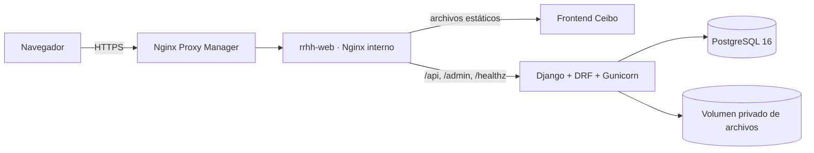

# Arquitectura canónica del MVP1

**Sistema:** Gestión RRHH · Grupo Vial Victoria
**Estado de esta decisión:** objetivo de producción del MVP1
**Actualizado:** 2026-07-24

Este documento concentra las decisiones vigentes del producto. Si una especificación
histórica contradice al código, a las migraciones o a este documento, no debe usarse para
implementar sin volver a validarla. El orden de autoridad es:

1. constraints y migraciones de la base;
2. services, permissions y selectors;
3. serializers/OpenAPI y tests;
4. este documento;
5. especificaciones históricas de `Conocimiento/`.

## 1. Alcance confirmado

- MVP1 administra empleados, relaciones laborales, documentos, novedades, alertas,
  reportes, onboarding/offboarding y auditoría.
- Una persona puede tener varias relaciones en su historia, pero como máximo **una
  relación activa en todo el grupo** y las vigencias no se superponen.
- Cada relación pertenece a una empresa, un sector y un puesto. Cada puesto pertenece a
  un único sector.
- Un usuario con rol Supervisor tiene N empleados a cargo mediante
  `RelacionLaboral.supervisor`. No se infiere el equipo por empresa o por sector.
- Los documentos pertenecen a una relación laboral. Un reingreso crea otra relación y
  exige de nuevo su documentación y onboarding; lo presentado antes queda como historia.
- El onboarding/offboarding se parametriza por empresa, sector y tipo de proceso. Una
  plantilla publicada es inmutable; una nueva versión parte de un borrador.
- Rechazar o anular una novedad exige un motivo explícito. El workflow operativo es
  `REGISTRADA → EN_PROCESO → APROBADA → CERRADA`, con salidas controladas a
  `RECHAZADA` o `ANULADA`.
- La importación Excel queda diferida hasta confirmar que existe una fuente real que
  migrar. No forma parte del criterio de salida a producción.
- El rol Servicio queda reservado para una autenticación máquina-a-máquina futura
  (n8n, bots u otros consumidores). No abre una sesión humana.
- Asistencias, biometría y el punto 10 que se desarrolla por separado no se amplían en
  esta remediación.

## 2. Arquitectura



- Nginx Proxy Manager es el único proxy público y termina TLS.
- `rrhh-web` es el único contenedor de la aplicación conectado a la red externa
  `reverse-proxy`.
- API, PostgreSQL y el volumen de archivos quedan detrás de redes privadas. No se
  publican los puertos 8000 ni 5432.
- El frontend y la API comparten origen. El frontend usa rutas relativas `/api/v1`;
  producción no depende de `localhost`, CORS ni tokens visibles para JavaScript.
- Los archivos médicos y respaldos no se sirven desde `MEDIA_URL`. Solo salen por
  endpoints autenticados y scopeados.
- `/gateway-healthz` comprueba únicamente el gateway. `/healthz` atraviesa el gateway y
  comprueba Django más una consulta mínima a PostgreSQL; es el endpoint de readiness que
  debe monitorearse externamente.
- Django usa un rol PostgreSQL de ejecución sin privilegios de propietario, superusuario,
  creación de roles, creación de bases ni bypass de RLS. Las migraciones usan otra
  credencial operativa, que nunca se monta dentro del contenedor API en ejecución.

## 3. Autenticación y autorización

### Personas

- Django mantiene la sesión en servidor.
- El navegador recibe una cookie `Secure`, `HttpOnly` y `SameSite=Strict` en producción.
- Toda escritura exige CSRF. El cliente obtiene `csrftoken` en
  `GET /api/v1/auth/csrf/` y envía `X-CSRFToken`.
- `POST /api/v1/auth/login/` crea la sesión; no devuelve access/refresh tokens.
- `POST /api/v1/auth/logout/` invalida la sesión.
- Las contraseñas nuevas se validan con mínimo 12 caracteres y se almacenan con Argon2.
- Las respuestas `/api/` llevan `Cache-Control: no-store, private`.

### Roles

| Rol | Alcance |
|---|---|
| Admin | Administración y lectura de auditoría |
| RRHH | Operación completa del dominio, sin acceso a la bitácora transversal |
| Supervisor | Solo empleados asignados mediante una relación activa; sin PII innecesaria |
| Empleado | Solo su propia ficha y sus propios datos permitidos |
| Servicio | Reservado; sin login humano y sin credencial M2M en MVP1 |

Ocultar un botón en el frontend no es seguridad. Cada endpoint vuelve a comprobar rol y
scope en el backend. Los selectors deben fallar cerrados.

- Servicio es un rol exclusivo: una cuenta de Servicio no puede compartir roles humanos.
  Si una sesión humana existente recibe ese rol, la autenticación se revoca en la
  siguiente request.
- Los roles humanos combinados usan la unión segura de sus alcances. Por ejemplo,
  Supervisor+Empleado puede ver su propia ficha y el equipo activo que tiene asignado,
  pero los archivos documentales y médicos continúan siendo solo propios.
- Reportes históricos transversales son solo para Admin/RRHH. El Supervisor puede ver el
  estado operativo actual de su equipo, pero no métricas históricas: la asignación de
  supervisor todavía no conserva vigencias y atribuirle historia anterior sería falso.

### Contratos de privacidad del API

- `GET /api/v1/empleados/` devuelve un resumen operativo sin DNI, CUIL, domicilio,
  teléfono, email, huella ni relaciones históricas completas.
- La ficha completa se obtiene con `GET /api/v1/empleados/{id}/`; la lectura queda
  auditada y el backend vuelve a aplicar el scope del actor.
- Para distinguir un alta de un reingreso, Admin/RRHH humano usa
  `GET /api/v1/empleados/por-dni/?dni=...`. La coincidencia es exacta, normaliza puntos,
  guiones y espacios, nunca acepta prefijos y registra la consulta si encuentra la
  persona. No se reintroduce el DNI en el listado.
- Un usuario que también pertenezca al grupo Servicio no puede usar la consulta por DNI
  ni iniciar una sesión humana, aunque además tenga otro rol.
- Supervisor recibe de novedades solo los campos operativos necesarios. Motivo,
  observaciones, certificado y razones de rechazo/anulación quedan reservados a RRHH,
  Admin y al propio empleado cuando corresponda.

## 4. Invariantes del dominio

### Organización y relaciones

- `Puesto.sector` es obligatorio en toda carga nueva.
- Una relación activa requiere empresa, sector y puesto activos.
- El puesto elegido debe pertenecer al sector elegido.
- El supervisor, si existe, debe ser un usuario activo con rol Supervisor.
- El catálogo mínimo de supervisores está disponible solo para Admin/RRHH humano en
  `GET /api/v1/supervisores/`. La asignación se hace sobre una relación activa mediante
  `PATCH /api/v1/empleados/{empleado}/relaciones/{relacion}/supervisor/` y siempre se
  audita.
- `fecha_egreso >= fecha_ingreso`.
- La fecha de nacimiento no puede estar en el futuro y un vencimiento de contrato no
  puede ser anterior al ingreso.
- Las fechas de dos relaciones de la misma persona no se pisan; ambos extremos son
  inclusivos.
- La baja es lógica: finaliza la relación, nunca borra la persona.
- La asignación vigente permite editar sector, puesto, jornada, tipo de contrato y su
  vencimiento. Empresa, ingreso, estado y supervisor tienen endpoints propios.
- Cambiar de sector queda bloqueado cuando ya existe onboarding/offboarding para la
  relación, porque el proceso fotografió el alcance original. Una promoción de puesto
  dentro del mismo sector sí es válida.
- Los cambios concurrentes se serializan y las constraints de PostgreSQL son la última
  barrera.

### Documentos y reingresos

- `DocumentoEmpleado` referencia tanto al empleado como a la relación laboral.
- La unicidad es `(relacion_laboral, tipo_documento)`, no `(empleado, tipo_documento)`.
- El flujo normal lista y modifica documentos de la relación activa.
- Un proceso de onboarding documental solo se completa con un documento de la misma
  relación. Un documento de un ingreso anterior no completa el nuevo proceso.
- Los binarios reemplazados o eliminados se borran después del commit para evitar
  archivos huérfanos o pérdida por rollback.

### Novedades

- Toda novedad referencia la relación laboral a la que pertenece.
- Sus fechas deben caer dentro de la vigencia de esa relación.
- Los tipos inactivos no aceptan nuevas cargas.
- Las horas extra exigen cantidad positiva; los tipos que no usan horas no la admiten.
- Los tipos que ocupan período no pueden solaparse para la misma persona. La validación
  amigable vive en el service y un `ExclusionConstraint` cierra carreras en PostgreSQL.
- Las prórrogas apuntan siempre a la madre, son contiguas y se resuelven de a una.
- `fecha_aviso_empleado`, turno de praxis, fin estimado, reintegro y recepción de
  certificado deben respetar el orden cronológico del evento.
- Las transiciones se ejecutan mediante endpoints de acción; nunca se cambia `estado`
  mediante PATCH genérico.
- Cerrar una novedad de rango abierto exige `fecha_hasta` en la misma acción de cierre.
  La fecha, la transición y su auditoría se confirman atómicamente.
- Dashboard y reportes consideran la vigencia efectiva de las prórrogas aprobadas o
  cerradas al decidir si una licencia cruza el período consultado.

### Onboarding y offboarding

- El alcance exacto es `(empresa, sector, tipo_proceso)`.
- Si no existe plantilla específica para el sector, puede usarse la plantilla general de
  la empresa.
- Solo puede existir un borrador y una publicada por alcance.
- Publicar archiva la versión publicada anterior.
- `GET` no crea procesos. El inicio es un `POST` explícito e idempotente.
- El proceso fotografía los ítems de su plantilla; publicar otra versión no reescribe
  procesos históricos.

## 5. Auditoría

`RegistroAuditoria` es una bitácora append-only:

- registra actor, nombre congelado del actor, momento, IP validada, acción semántica,
  objeto, agregado funcional, empleado afectado y diff;
- triggers de PostgreSQL impiden UPDATE, DELETE y TRUNCATE;
- las FKs de actor y empleado usan `PROTECT`;
- no guarda contraseñas ni contenido binario;
- también registra lecturas sensibles: detalle completo, fotos y descargas de documentos
  o adjuntos;
- solo Admin consulta la bitácora transversal.

Los services escriben el evento en la misma transacción que el cambio. Si no puede
registrarse la auditoría, tampoco se confirma la operación de negocio.

Las actualizaciones genéricas toman un lock y vuelven a leer la fila antes de construir
el “antes”. Esto evita que dos requests concurrentes produzcan diffs falsos o pierdan la
trazabilidad del primer cambio.

## 6. Archivos

- Extensiones permitidas de documentos: PDF, JPEG, PNG y WebP.
- Fotos: JPEG, PNG y WebP; nunca SVG.
- Se valida tamaño, firma real, integridad de imagen y límite de píxeles.
- Las fotos se vuelven a codificar para eliminar metadatos como EXIF.
- Las descargas de documentos se fuerzan como attachment.
- El límite se aplica en Nginx y de nuevo durante la recepción de Django.
- El volumen de archivos debe incluirse en el backup junto con la base. Una copia de solo
  PostgreSQL no es un backup completo del sistema.

Antivirus de contenido y almacenamiento de objetos son mejoras operativas posteriores;
no debe habilitarse carga pública o anónima mientras no existan.

## 7. Dependencias y build

- `requirements.in` y `requirements-dev.in` expresan rangos directos.
- Los `.txt` son locks reproducibles con hashes.
- Docker y CI instalan con `pip --require-hashes`.
- `pip-audit` debe terminar sin vulnerabilidades conocidas.
- La imagen corre como usuario no root, con filesystem de solo lectura y capacidades
  Linux eliminadas.
- El rol PostgreSQL de la API no es dueño de las tablas y no puede deshabilitar los
  triggers de auditoría; el rol propietario se usa únicamente en tareas operativas de
  migración.
- La imagen desplegada debe identificarse por tag inmutable o digest; no usar `latest`.
- El frontend de producción no debe buscar React, Babel, fuentes ni otro código en CDN.

## 8. Gates obligatorios

Antes de etiquetar o desplegar:

```bash
docker compose exec -T api ruff check .
docker compose exec -T api python manage.py makemigrations --check --dry-run
docker compose exec -T api python manage.py migrate
docker compose exec -T api pytest
docker compose exec -T api python manage.py spectacular \
  --validate --fail-on-warn --file /tmp/openapi.yaml
docker compose exec -T api pip-audit -r requirements.txt --disable-pip
python frontend/tests/test_invariantes_diseno.py
python frontend/tests/test_guardas_frontend.py
python frontend/build.py
```

También se valida `manage.py check --deploy`, las dos imágenes de producción y
`docker compose config`. En un stack aislado se comprueba además que el rol runtime puede
operar la aplicación pero no puede ejecutar DDL, deshabilitar triggers ni truncar la
bitácora.

## 9. Despliegue y migraciones

El despliegue es una operación separada de la implementación. Requiere confirmación
explícita y este orden:

1. identificar el commit/tag exacto;
2. copiar y verificar backup de PostgreSQL y del volumen de archivos;
3. construir imágenes sin secretos;
4. ejecutar los preflights de datos de las migraciones;
5. correr `migrate` como tarea única;
6. iniciar los servicios privados;
7. comprobar `/healthz/`, login, CSRF, permisos y descarga protegida;
8. habilitar o actualizar el Proxy Host de NPM;
9. conservar la imagen anterior y un procedimiento probado de restore.

Las migraciones que encuentran relaciones solapadas, más de una relación activa o datos
que no pueden atribuirse de manera inequívoca deben detenerse mostrando IDs. Nunca deben
inventar empresa, sector, puesto, fecha o responsable para “hacer pasar” el deploy.

### Preflight del conjunto de datos existente

La remediación se ensayó sobre una copia de la base local y se detuvo de forma segura. El
deploy queda bloqueado hasta que RRHH resuelva, por ID y sin exponer PII en logs:

- relaciones activas sin puesto: `1, 23, 24, 25, 27, 28`;
- relaciones solapadas del empleado `15`: `17/23`, `23/18`, `23/19`;
- identificadores legados inválidos: empleado `11` (CUIL), `15` (CUIL), `16` (CUIL),
  `17` (DNI y CUIL) y `18` (DNI).

No se detectaron colisiones después de normalizar DNI/CUIL. Estos IDs son un insumo de
saneamiento, no autorización para corregir datos automáticamente.

### Datos operativos obligatorios antes de la VPS

- backup restaurable de PostgreSQL y del volumen de archivos;
- nombres exactos de los volúmenes externos `RRHH_POSTGRES_VOLUME` y
  `RRHH_MEDIA_VOLUME`;
- imagen inmutable `RRHH_POSTGRES_IMAGE` y tag/digest inmutable de la aplicación;
- secretos distintos para owner/migraciones y runtime;
- UID/GID `10001:10001` con escritura efectiva sobre media;
- límites de CPU/RAM definidos según la capacidad real de la VPS.

## 10. Backlog explícitamente diferido

- autenticación M2M del rol Servicio con credenciales revocables y scopes mínimos;
- integraciones n8n/WhatsApp;
- importación Excel, solo si se confirma una fuente real;
- biometría, asistencias y cálculo automático de horas;
- almacenamiento S3/R2 y análisis antivirus;
- paginación server-side completa del frontend cuando el volumen lo justifique.
