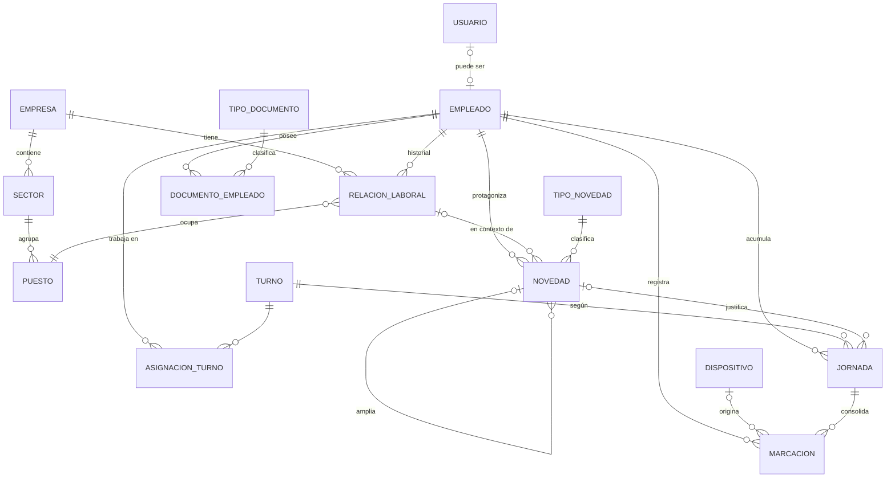

# Propuesta técnica — Sistema de RRHH y Control de Asistencias

> **Origen:** este documento re-fundamenta técnicamente la especificación funcional `MODULO_RRHH_SPEC.md` (pensada para n8n + Google Sheets) sobre el nuevo stack: **Django + DRF + PostgreSQL, monolito modular**. Toma la spec como definición de *qué* hace el sistema y marca dónde la extiende o ajusta.
>
> Decisiones ya incorporadas desde la spec: baja lógica vía relación laboral (caso DAMIAN con 2 relaciones), tipos de novedad reales (accidente/falta/licencia/vacaciones, con ampliaciones), los 4 gaps identificados (§2 de la spec), y n8n/Telegram como consumidores.
>
> **Fecha:** 2026-07-07 · **Actualización:** 2026-07-07 — preguntas P1–P10 respondidas por el dueño del producto; MVP1 re-alcanzado (ver §0) y flujo de prórroga de licencias definido (ver §6 bis).

---

## 0. Decisiones confirmadas

*(Las preguntas abiertas de la versión inicial fueron respondidas por el dueño del producto el 2026-07-07. Quedan como decisiones de diseño.)*

| # | Tema | Decisión |
|---|---|---|
| P1 | Multiempresa | **Sí, desde el día 1.** Es un **grupo empresarial que comparte recursos**: entidad `Empresa`, empleado (persona) único a nivel grupo, relación laboral por empresa. Misma DB, sin multi-tenant estricto. |
| P2 | Biometría | Existe un reloj físico pero **todavía no hay API para conectarlo** → la integración queda en **stand-by**, pero prevista en el diseño (contrato de ingesta §13, `id_huella` en Empleado). Además hay **empleados exonerados de marcar** → flag `exento_marcacion` en Empleado desde el día 1. |
| P3 | País / legislación | **Solo Argentina.** Los documentos existen únicamente para **validar vencimientos y evitar irregularidades** — sin liquidación, sin convenios. |
| P4 | Horas extra | En MVP1 se registran como **novedad manual**: tipo `HORAS_EXTRA` con campo `cantidad_horas` ("empleado X hizo N horas extra"). El cálculo automático llega recién cuando la huella entre por API. |
| P5 | Zona horaria | Única: `America/Argentina/Buenos_Aires`. Todo en UTC en DB (`USE_TZ=True`), se muestra en local. |
| P6 | Tolerancias de fichaje | **Parametrizables**, pero **aplican recién cuando exista huella por API** (fase de asistencias). En MVP1 no hay cómputo de tardanzas. |
| P7 | Volumen | **< 500 empleados.** Postgres simple, sin particionar, sin colas. |
| P8 | Alertas | Hoy **no hay alertas por ninguna vía**; el canal objetivo es **WhatsApp**. El backend expone feeds (`/alertas/*`) y el envío lo hará n8n/bot de WhatsApp cuando se implemente esa fase. |
| P9/P10 | Turnos | Los turnos reales son **rotativos**. Pero **todo lo relativo a horario laboral, asistencias y faltas automáticas queda FUERA del MVP1**: se deja el modelo previsto (no se implementa). La `FALTA` en MVP1 es solo un registro manual de novedad con su ID. |

### Re-alcance del MVP1 (definición 2026-07-07)

El corazón del MVP1 es:
1. **CRUD de empleados**: multiempresa, relaciones laborales con baja lógica e historial, documentos con vencimiento.
2. **Novedades cargadas por el sistema**: faltas (registro manual), licencias con **prórrogas trazables** (ver §6 bis), vacaciones, accidentes, permisos y horas extra manuales.

Con **énfasis en programación escalable**: el modelo de datos ya contempla turnos/marcaciones/jornadas/biometría para que esas fases entren después **sin re-trabajo ni migraciones destructivas**, pero no se implementa nada de ese pipeline en MVP1.

### Supuestos adicionales
- El Excel `EMPLEADOS.xlsx` actual se **migra** a Postgres con un comando de import (no conviven dos fuentes de verdad). *(Ajuste sobre la spec §0, que decía "Sheets alcanza": al pasar a Django, Sheets deja de ser la base y pasa a ser origen de migración única.)*
- Los bots de Telegram/WhatsApp y n8n consumen la **misma API v1** que el frontend de Claude Design, con usuarios de servicio.
- Español rioplatense en dominio; código idiomático en inglés donde corresponda.

---

## 1. Definición funcional del sistema

Sistema de gestión de RRHH y control de asistencias para empresas viales (Vial Victoria, Premocor), operado por el equipo de RRHH y supervisores de campo. Resuelve tres problemas: (a) **legajo confiable** — quién trabaja, en qué empresa, con qué documentación vigente (carnet, apto médico, CNRT); (b) **presentismo real** — quién marcó, quién llegó tarde, quién faltó y si la falta está justificada por una novedad; (c) **alertas y métricas** — vencimientos, cumpleaños, antigüedad, ausentismo y rotación sin revisar planillas a mano.

**Flujo principal:** RRHH da de alta al empleado con su relación laboral y documentos → se le asigna un turno → el empleado marca entrada/salida (web hoy, huella mañana) → el sistema computa la jornada (puntual/tarde/ausente) y la cruza contra novedades (licencias, vacaciones) → las ausencias sin justificar generan novedades automáticas → n8n consulta la API cada mañana y despacha las alertas por Telegram → RRHH consulta reportes de ausentismo, dotación y rotación.

---

## 2. Alcance del MVP

| Funcionalidad | ¿MVP1? | Justificación |
|---|---|---|
| Usuarios, roles y permisos (4 roles) | ✅ | Sin esto no hay nada seguro que exponer. |
| Empresas (catálogo del grupo empresarial) | ✅ | P1 confirmado: multiempresa día 1; agregarlo después es una migración dolorosa. |
| Empleados + Relación laboral (baja lógica, historial, flag `exento_marcacion`) | ✅ | Núcleo de la spec §1.1 y del re-alcance; validado con datos reales. |
| Documentos y vencimientos (carnet, apto, CNRT, contrato) | ✅ | P3: los documentos existen para validar vencimientos; gap #1 de la spec §2. |
| Novedades (falta manual/licencia/vacaciones/accidente/enfermedad/permiso) | ✅ | Spec §1.2 — es la mitad del corazón del MVP1. |
| **Prórrogas de licencia con traza** (cadena de novedades, ver §6 bis) | ✅ | Requisito explícito: sin inconsistencias y con traza completa. |
| Novedad `HORAS_EXTRA` con `cantidad_horas` (carga manual) | ✅ | P4: registro manual hasta que la huella entre por API. |
| Endpoints de alertas (vencimientos, cumpleaños, antigüedad, certificados pendientes) | ✅ | Solo el **feed JSON** (lectura); el envío por WhatsApp es fase posterior. Reemplaza §1.3/§1.7 de la spec. |
| Reportes de dotación, rotación y novedades por período | ✅ | Spec §1.6, ahora con SQL real. Solo lo que no depende de asistencias. |
| Auditoría de cambios en entidades sensibles | ✅ | Barata de incorporar desde el día 1, imposible de reconstruir después. |
| Import inicial desde `EMPLEADOS.xlsx` (incluye `id_huella`) | ✅ | Corte de fuente única; el `ID_HUELLA` queda guardado para la fase biométrica. |
| Turnos (rotativos) + asignaciones | ❌ Fase asistencias | P9/P10: se omite todo lo de horario laboral por ahora; el modelo queda previsto. |
| Marcaciones (manual/web/CSV/dispositivo) | ❌ Fase asistencias | Diferido junto con turnos; el contrato de ingesta (§13) queda diseñado. |
| Cómputo de jornada (tardanza/ausencia) y tolerancias | ❌ Fase asistencias | P6: tolerancias aplican recién con huella por API. |
| Cross-check: ausencia sin novedad ⇒ FALTA automática | ❌ Fase asistencias | Requiere fuente de asistencia; en MVP1 la falta se carga a mano. |
| Envío de alertas por WhatsApp | ❌ Fase 2 | P8: canal objetivo WhatsApp; el backend ya expone los feeds. |
| Integración con reloj biométrico | ❌ Stand-by | P2: no hay API del reloj todavía; diseño previsto en §13. |
| Horas extra automáticas / liquidación / export a contable | ❌ | Dependen de biometría por API (P4) / spec MVP2. |
| Firma digital de recibos | ❌ | Spec MVP2; depende de proveedor externo. |
| Carga de documentación adjunta (archivos/Drive) | ❌ | MVP1 guarda **fechas de vencimiento**; los PDFs van después. |
| Portal de autogestión del empleado | ❌ | El rol Empleado en MVP1 solo ve lo propio; autogestión completa es fase de crecimiento. |
| Medidas disciplinarias | ❌ | Spec MVP2; tabla trivial de agregar luego (no bloquea nada). |

---

## 3. Módulos principales

*(Ajuste sobre la lista inicial: se agrega **Organización** — empresas y parámetros — y "documentos y vencimientos" se mueve adentro de Empleados. "Reportes" y "Auditoría" quedan como módulos transversales delgados.)*

| # | Módulo | Responsabilidad |
|---|---|---|
| 1 | **Organización** (núcleo) | Empresas, sectores/puestos, parámetros del sistema (tolerancias default, días de gracia de certificados). |
| 2 | **Usuarios y accesos** | Usuario custom, roles (grupos), autenticación JWT, usuarios de servicio (n8n, bots). |
| 3 | **Empleados** | Persona, relación laboral (historial, baja lógica), documentos con vencimiento. |
| 4 | **Horarios y turnos** | Definición de turnos, asignación empleado↔turno con vigencia. |
| 5 | **Asistencias** | Marcaciones crudas (inmutables), jornadas computadas, cierre diario, import CSV. |
| 6 | **Novedades** | Ausencias, licencias, permisos, accidentes; ciclo de aprobación; ampliaciones; certificados. |
| 7 | **Dispositivos** | Registro de relojes/lectores, credenciales de dispositivo, ingesta idempotente de marcaciones. |
| 8 | **Reportes** | Solo lectura: agregaciones de asistencia, ausentismo, dotación, rotación, y los feeds de alertas para n8n. |
| 9 | **Auditoría** | Registro quién/qué/cuándo/antes/después sobre entidades sensibles. |

---

## 4. Entidades y relaciones

**Entidades:** Empresa, Sector, Puesto, Usuario, Empleado, RelacionLaboral, TipoDocumento, DocumentoEmpleado, Turno, AsignacionTurno, Marcacion, Jornada, TipoNovedad, Novedad, Dispositivo, RegistroAuditoria, Parametro.

**Relaciones clave:**
- Empleado 1:N RelacionLaboral; RelacionLaboral N:1 Empresa (así una persona tiene historial en Vial Victoria y Premocor — caso DAMIAN de la spec).
- **[MEJORA SUGERIDA — ajuste al gap #3 de la spec]** La spec señala que `NOVEDADES` apunta a `ID_RELACION_LABORAL` y que los rankings por persona obligan a un join. Propuesta: `Novedad N:1 Empleado` (directo, para rankings) **+** FK a `RelacionLaboral` (para saber en qué empresa/contrato ocurrió). Redundancia mínima, consultas simples en ambos ejes.
- Novedad 1:N Novedad (autorreferencia `novedad_origen` para ampliaciones — caso "pie roto" ampliado).
- Empleado N:M Turno vía AsignacionTurno (con vigencia desde/hasta).
- Marcacion N:1 Empleado, N:1 Dispositivo (nullable: manual/web/CSV).
- Jornada N:1 Empleado, N:1 Turno, 1:N Marcacion (las marcaciones que la componen), FK opcional a Novedad justificante.



---

## 5. Modelo de datos inicial

**Convenciones globales:** PK = `id` BIGINT autoincremental (UUID solo donde se expone a dispositivos externos). Todos los modelos heredan de `ModeloBase`: `creado_en`, `actualizado_en`, `creado_por` (FK Usuario, nullable para procesos automáticos). **Soft delete solo donde el dominio lo pide** (Empleado vía estado de relación laboral, como manda la spec §1.1; TipoNovedad/Turno vía campo `activo`); el resto no se borra desde la API (se protege con `on_delete=PROTECT`). Nada de flag `is_deleted` genérico en todo: complica cada query y acá el historial ya está modelado explícitamente.

### Empleado
| Campo | Tipo | Restricciones | Notas |
|---|---|---|---|
| id | bigint PK | — | |
| legajo | varchar(20) | UNIQUE | Identificador humano. |
| dni | varchar(15) | UNIQUE, index | PII: exponer solo a RRHH/Admin. |
| cuil | varchar(15) | UNIQUE null | |
| nombre / apellido | varchar(100) | NOT NULL | |
| fecha_nacimiento | date | null | Para alerta de cumpleaños (spec §1.3). |
| telefono / email | varchar | null | Gap #4 de la spec: hacerlos visibles como "dato faltante" en UI. |
| direccion | varchar(255) | null | |
| id_huella | varchar(50) | UNIQUE null, index | Ya existe en el Excel; se guarda desde MVP1 para el matching biométrico futuro (P2). En el front: "ID de huella (Ej. HUELLA-0042)". |
| exento_marcacion | bool | default false | P2: empleados exonerados de marcar. En MVP1 es solo dato; cuando haya asistencias, excluye del cómputo de ausencias/tardanzas. |
| educacion | choices | null | Del front (§21): Primario incompleto → Universitario. |
| contacto_emergencia | varchar(200) | null | Del front: "Nombre · vínculo · teléfono" (un solo campo en MVP1). |
| obra_social | varchar(100) | null | Del front, sección "Cobertura". |
| art | varchar(100) | null | Del front, sección "Cobertura" (aseguradora de riesgos). |
| observaciones | text | null | Del front: "Notas internas, aclaraciones, antecedentes…". |
| usuario | FK Usuario | UNIQUE null | Solo si el empleado accede al sistema. |

### RelacionLaboral
| Campo | Tipo | Restricciones | Notas |
|---|---|---|---|
| empleado | FK Empleado | NOT NULL, index | |
| empresa | FK Empresa | NOT NULL | |
| sector | FK Sector | null | Del front (§21): catálogo transversal al grupo (RRHH, Administración, Obra, Logística). |
| puesto | FK Puesto | null | |
| fecha_ingreso | date | NOT NULL | Base de antigüedad (spec §1.7). |
| jornada_legal | choices | null | Del front: COMPLETA_8H / REDUCIDA_6H / MEDIA_4H / ROTATIVA. Dato declarativo en MVP1 (sin cómputo). |
| fecha_egreso | date | null | |
| motivo_egreso | varchar(30) choices | null | RENUNCIA, FIN_CONTRATO, DESPIDO, JUBILACION, MUDANZA, OTRO (lista del front §21); alimenta rotación. |
| estado | varchar(10) | ACTIVA / FINALIZADA | **Constraint DB:** única relación ACTIVA por (empleado, empresa) — índice único parcial. |
| tipo_contrato | choices | INDETERMINADO default | |
| fecha_vencimiento_contrato | date | null | Alerta "contrato por vencer" (spec §1.3). |

### DocumentoEmpleado
| Campo | Tipo | Restricciones | Notas |
|---|---|---|---|
| empleado | FK | NOT NULL, index | |
| tipo_documento | FK TipoDocumento | NOT NULL | Catálogo: CARNET_CONDUCIR, APTO_MEDICO, CNRT, etc. (cierra gap #1). |
| numero | varchar | null | |
| fecha_vencimiento | date | null, **index** | La query de alertas filtra por acá. |
| observaciones | text | null | |
| UNIQUE | | (empleado, tipo_documento) | Un vigente por tipo; histórico vía auditoría. |

> **Las 4 entidades siguientes (Turno, AsignacionTurno, Marcacion, Jornada) NO se implementan en MVP1** (decisión P9/P10). Quedan especificadas acá para que el diseño de Empleado/Novedad no las bloquee: cuando llegue la fase de asistencias se agregan como apps/migraciones nuevas, sin tocar lo existente. Para turnos **rotativos**, la fase de asistencias deberá agregar además una entidad `PatronRotacion` (secuencia de turnos con ciclo en días) de la que se derivan las asignaciones.

### Turno *(previsto — fase asistencias)*
| Campo | Tipo | Restricciones | Notas |
|---|---|---|---|
| nombre | varchar(60) | UNIQUE | |
| hora_entrada / hora_salida | time | NOT NULL | Si salida < entrada ⇒ **cruza medianoche** (soportado desde el modelo). |
| dias_semana | int[] o bitmask | NOT NULL | Ej. [0..4] = lunes-viernes. |
| tolerancia_entrada_min | smallint | default 10 | P6. |
| activo | bool | default true | Soft delete. |

### AsignacionTurno *(previsto — fase asistencias)*
| Campo | Tipo | Restricciones | Notas |
|---|---|---|---|
| empleado / turno | FK | NOT NULL | |
| vigencia_desde | date | NOT NULL | |
| vigencia_hasta | date | null = vigente | **Constraint de exclusión Postgres** (`daterange` + GiST): sin solapamiento de asignaciones por empleado. |

### Marcacion *(previsto — fase asistencias/biometría)* (inmutable — nunca UPDATE/DELETE)
| Campo | Tipo | Restricciones | Notas |
|---|---|---|---|
| id | UUID PK | — | Se expone a dispositivos. |
| empleado | FK | null, index | Null si aún no se matcheó `id_huella` (queda "huérfana" para revisión). |
| momento | timestamptz | NOT NULL, index | |
| tipo | choices | ENTRADA / SALIDA / DESCONOCIDO | Los relojes baratos no distinguen: el cómputo infiere por orden. |
| origen | choices | WEB / MANUAL / DISPOSITIVO / IMPORT | |
| dispositivo | FK | null | |
| id_externo | varchar | null | ID en el reloj. **UNIQUE (dispositivo, id_externo)** ⇒ idempotencia (§13). |
| anulada / motivo_anulacion | bool + text | default false | Corrección sin borrar: se anula y se crea otra (trazabilidad). |

### Jornada *(previsto — fase asistencias)* (computada, recalculable)
| Campo | Tipo | Restricciones | Notas |
|---|---|---|---|
| empleado / fecha | FK + date | **UNIQUE juntos**, index | |
| turno | FK | null | Turno vigente ese día. |
| entrada_real / salida_real | timestamptz | null | Derivadas de marcaciones. |
| minutos_tardanza | smallint | default 0 | |
| horas_trabajadas | decimal(4,2) | null | |
| estado | choices | PUNTUAL / TARDE / AUSENTE / INCOMPLETA / JUSTIFICADA / NO_LABORABLE | |
| novedad_justificante | FK Novedad | null | El cross-check de la spec §1.4 vive acá. |
| cerrada | bool | default false | Cerrada por proceso diario; recalculable mientras no esté cerrada. |

### Novedad
| Campo | Tipo | Restricciones | Notas |
|---|---|---|---|
| empleado | FK | NOT NULL, index | Mejora sobre gap #3 (ver §4). |
| relacion_laboral | FK | null | Contexto empresa/contrato. |
| tipo_novedad | FK catálogo | NOT NULL | FALTA, LICENCIA_MEDICA, VACACIONES, ACCIDENTE, PERMISO, **HORAS_EXTRA** (P4)… con flags `justifica_ausencia`, `requiere_certificado`, `admite_prorroga`, `requiere_cantidad_horas`. |
| fecha_desde / fecha_hasta | date | NOT NULL / null | Rango; hasta null = abierta. |
| cantidad_horas | decimal(5,2) | null | Solo para tipos con `requiere_cantidad_horas` (HORAS_EXTRA manual, P4). |
| estado | choices | REGISTRADA / EN_PROCESO / APROBADA / RECHAZADA / CERRADA / ANULADA | Set canónico reconciliado con el front (§21); transiciones solo por endpoints de acción. |
| clasificacion | choices | null | JUSTIFICADA / INJUSTIFICADA — en el front aparece como "Validado / Injustificado". Es clasificación, no workflow. |
| motivo / observaciones | varchar + text | | Front: "Ej. pie roto, no avisa…". |
| fecha_aviso_empleado | date | null | Del front: cuándo avisó el empleado. |
| novedad_origen | FK self | null, index | **Prórrogas/ampliaciones**: apunta SIEMPRE a la novedad madre de la cadena (ver §6 bis). |
| requiere_praxis | bool | default false | Del front: "Marcar si interviene ART / seguimiento médico". |
| fecha_turno_praxis / fecha_fin_estimada / fecha_reintegro | date ×3 | null | Bloque "Seguimiento praxis / ART" del front; cubre la alerta "praxis sin confirmación" de la spec §1.3. |
| certificado_recibido_en | date | null | Alerta "sin certificado tras X días" (spec §1.3). El archivo adjunto del certificado va en fase posterior (§21). |
| generada_automaticamente | bool | default false | Distingue cross-check de carga manual. |
| aprobada_por / aprobada_en | FK Usuario + ts | null | |

### Dispositivo
| Campo | Tipo | Restricciones | Notas |
|---|---|---|---|
| id | UUID PK | | |
| nombre / ubicacion | varchar | | |
| tipo | choices | RELOJ_HUELLA / APP / OTRO | |
| clave_api_hash | varchar | NOT NULL | Se guarda hasheada; el token vivo solo se muestra al crear. |
| activo | bool | | |
| ultimo_contacto_en | timestamptz | null | Alerta "reloj caído". |

### RegistroAuditoria — ver §14. **Usuario** extiende `AbstractUser` + FK opcional a Empleado.

---

## 6. Reglas de negocio

> **Alcance MVP1:** aplican R1, R9, R10, R11, R12 y todo §6 bis. Las reglas **R2–R8 pertenecen a la fase de asistencias** (P6/P9/P10): quedan especificadas para que el diseño no las bloquee, pero no se implementan en MVP1. R4 además excluye a empleados con `exento_marcacion=True`.

| # | Regla | ¿Dónde vive? |
|---|---|---|
| R1 | Única relación laboral ACTIVA por (empleado, empresa). | **DB** (índice único parcial) + validación en service para error amigable. |
| R2 | Asignaciones de turno sin solapamiento temporal. | **DB** (exclusion constraint) + service. |
| R3 | Tardanza: `entrada_real > hora_entrada_turno + tolerancia` ⇒ estado TARDE con `minutos_tardanza` desde la hora teórica (la tolerancia perdona el estado, no descuenta minutos). | **Service** (`computar_jornada`). |
| R4 | Ausencia: día laborable según turno vigente, sin marcación de entrada al cierre ⇒ AUSENTE. | **Service** (proceso de cierre diario). |
| R5 | Cross-check (spec §1.4): al cerrar jornada AUSENTE, si existe novedad APROBADA que cubre la fecha y `justifica_ausencia` ⇒ JUSTIFICADA con FK; si no ⇒ se crea Novedad FALTA `generada_automaticamente=True` en estado PENDIENTE (RRHH decide si justifica). | **Service** dedicado. |
| R6 | Marcaciones inmutables: corrección = anular + crear nueva; la jornada se recalcula. | **Service** + sin endpoints UPDATE/DELETE. |
| R7 | Turno nocturno: si `hora_salida < hora_entrada`, la salida se busca en el día siguiente; la jornada pertenece a la fecha de entrada. | **Service**. |
| R8 | Duplicados de fichada: dos marcaciones del mismo empleado en < N min (default 3) ⇒ la segunda se registra pero se marca ignorada para el cómputo. | **Service** (nunca se descarta el dato crudo). |
| R9 | Novedades tipo ACCIDENTE/ENFERMEDAD sin `certificado_recibido_en` tras X días ⇒ aparecen en feed de alertas (spec §1.3). | **Selector** (query del feed; no muta estado). |
| R10 | Baja de empleado = finalizar relación laboral (fecha + motivo); prohibido DELETE físico. | **Service** + `on_delete=PROTECT` en DB. |
| R11 | Solo novedades APROBADAS justifican jornadas. Aprobar/rechazar exige rol RRHH/Admin. | **Service** + capa de permisos. |
| R12 | Validaciones de forma (fechas coherentes, campos requeridos) en **Serializer**. Las de consistencia contra DB (solapamientos, duplicados), en **service**. | Serializer / Service. |

- **[RESUELTO 2026-07-07]** R3: tolerancias parametrizables y aplicables **recién cuando exista huella por API** (P6). El detalle fino (si descuenta minutos o solo el estado) se define al implementar esa fase.
- **[RESUELTO 2026-07-07]** R5: el cross-check queda diferido a la fase de asistencias. **En MVP1 la FALTA se carga manualmente como novedad** y queda registrada con su ID (P9/P10).

---

## 6 bis. Flujo de prórroga de licencia (traza sin inconsistencias)

Requisito explícito del producto: un empleado va **prorrogando su licencia** (caso real de la spec §1.2: "pie roto" ampliado por una segunda novedad) y el sistema debe garantizar consistencia y traza completa.

### Modelo: cadena de novedades

Una licencia prorrogada es una **cadena**: 1 **novedad madre** + N **prórrogas**. Cada prórroga es un registro `Novedad` nuevo con:
- `novedad_origen` = **siempre la madre** (no la prórroga anterior): así traer la cadena completa es un solo query (`WHERE id = madre OR novedad_origen = madre`), sin recorrer recursivamente.
- Su **propio** rango de fechas, su propio estado, su propio certificado y su propio aprobador.

**Vigencia efectiva de la licencia** = `fecha_desde` de la madre → `MAX(fecha_hasta)` entre madre y prórrogas APROBADAS. Es un dato **calculado** (selector), nunca un campo editado: elimina la posibilidad de que la fecha "total" y la cadena se contradigan.

### Reglas (todas en el service `prorrogar_novedad`, transaccional)

| # | Regla |
|---|---|
| RP1 | Prorrogar **no edita** la novedad aprobada: las fechas de una novedad APROBADA son inmutables. Corregir = anular + recrear (queda traza). |
| RP2 | Solo se prorroga una novedad cuyo `tipo_novedad.admite_prorroga = True` y cuyo estado sea APROBADA (no se prorroga algo PENDIENTE, RECHAZADA ni ANULADA). |
| RP3 | La prórroga debe ser **contigua o solapada solo con su propia cadena**: `fecha_desde` ≤ (vigencia efectiva actual + 1 día). Si queda un hueco (ej. licencia terminó el 10 y la prórroga arranca el 20), no es prórroga: es una novedad nueva — el service lo rechaza con error claro. |
| RP4 | Una prórroga no puede solaparse con **otra** novedad aprobada del mismo empleado que justifique ausencia (validación de solapamiento global por empleado). |
| RP5 | La prórroga nace PENDIENTE y sigue el flujo normal de aprobación. Mientras está PENDIENTE, la vigencia efectiva no cambia. |
| RP6 | Anular una prórroga no toca la madre ni las prórrogas anteriores (la vigencia efectiva se recalcula sola). Anular la **madre** con prórrogas activas está **bloqueado**: hay que anular la cadena completa explícitamente (endpoint aparte, acción auditada). |
| RP7 | Cada prórroga hereda el tipo de la madre (no se puede "prorrogar" una licencia médica con vacaciones). |
| RP8 | Cada eslabón (creación, aprobación, rechazo, anulación de madre o prórroga) queda en `RegistroAuditoria` con acción semántica (`NOVEDAD_PRORROGADA`, `CADENA_ANULADA`, …). |

### API del flujo

- `POST /novedades/{id}/prorrogar/` — recibe `{fecha_hasta_nueva, motivo, certificado_recibido_en?}`; el service valida RP1–RP7 y crea la prórroga. Si `{id}` es una prórroga, la operación se redirige a la madre (el cliente no necesita saber cuál es la madre).
- `GET /novedades/{id}/cadena/` — devuelve `{madre, prorrogas: [...], vigencia_efectiva: {desde, hasta}, dias_totales}` ordenado cronológicamente. Es lo que el frontend (Claude Design) muestra como línea de tiempo de la licencia.
- Los listados (`GET /novedades/`) devuelven por defecto **cadenas colapsadas** (la madre con `vigencia_efectiva` y `cantidad_prorrogas`), con `?expandir_cadenas=true` para el detalle — así la lista de novedades no muestra 4 filas para una sola licencia.

---

## 7. Roles y permisos

| Rol | Puede ver | Puede crear/editar | Restricciones |
|---|---|---|---|
| **Admin** | Todo | Todo + usuarios, parámetros, dispositivos | — |
| **RRHH** | Todo lo operativo (todas las empresas) | Empleados, relaciones, documentos, novedades (incl. aprobar), turnos, marcaciones manuales, cierres | No gestiona usuarios ni parámetros. |
| **Supervisor** | Empleados y asistencia **de su sector/empresa** | Cargar novedades (nacen PENDIENTES), marcaciones manuales de su equipo | No aprueba novedades, no ve PII sensible (DNI parcial). |
| **Empleado** | **Solo lo propio**: sus jornadas, novedades, documentos y vencimientos | Nada en MVP (autogestión = Fase 3) | Scope forzado por objeto. |
| **Servicio** (n8n, bots) | Feeds de alertas y reportes | Según scope del token | Usuario técnico con permisos mínimos. |
| **Dispositivo** | — | Solo POST de marcaciones | No es Usuario Django: autentica por clave de dispositivo (§13). |

**Estrategia:** Grupos de Django = roles + clases `Permission` de DRF por acción (`RolRequerido("RRHH")`) + **scoping por queryset en selectors** (el Supervisor no "no puede ver": directamente su query no trae lo ajeno). Se evita permisos por objeto con librerías (django-guardian) — sobredimensionado para 4 roles; el filtrado por queryset resuelve lo mismo más simple y performante. Alternativa si algún día hay matrices finas por empresa: `django-rules`. **Recomendación: grupos + scoping**, migrar solo si duele.

---

## 8. Endpoints API recomendados

**Convenciones:** prefijo `/api/v1/`; paginación por página (`?page=&page_size=`, default 25, máx 100 — cómodo para tablas del frontend en Claude Design); filtros con `django-filter` (`?estado=ACTIVA&empresa=1&fecha_desde=…`); ordenamiento `?ordering=-fecha`; errores JSON uniformes `{codigo, detalle, campos:{}}`; OpenAPI autogenerada con `drf-spectacular` en `/api/schema/` — **esa schema es el contrato con Claude Design**: el frontend se alinea contra el YAML, no contra capturas.

| Método | Ruta | Descripción | Rol mínimo |
|---|---|---|---|
| POST | `/auth/token/` · `/auth/token/refresh/` | JWT login/refresh | público |
| GET/POST | `/empresas/` | Catálogo empresas | RRHH / Admin |
| GET/POST | `/empleados/` | Listado (filtros: empresa, estado, sector, búsqueda) / alta (crea relación laboral ACTIVA en la misma transacción, como spec §1.1) | Supervisor(ver) / RRHH |
| GET/PATCH | `/empleados/{id}/` | Detalle y edición | RRHH |
| POST | `/empleados/{id}/relaciones/{id}/finalizar/` | **Baja lógica** (fecha + motivo) | RRHH |
| GET/POST | `/empleados/{id}/documentos/` | Documentos y vencimientos | RRHH |
| GET/POST | `/novedades/` | Listado con filtros (por defecto cadenas colapsadas, §6 bis) / carga | Supervisor |
| PATCH | `/novedades/{id}/` | Edición (solo si PENDIENTE) | Supervisor |
| POST | `/novedades/{id}/aprobar/` · `/rechazar/` · `/anular/` | Transiciones explícitas (no PATCH de estado) | RRHH |
| POST | `/novedades/{id}/prorrogar/` | Crea prórroga en la cadena (§6 bis) | Supervisor |
| GET | `/novedades/{id}/cadena/` | Madre + prórrogas + vigencia efectiva (§6 bis) | Supervisor |
| GET | `/reportes/novedades/?desde=&hasta=` | Faltas just./injust., licencias, horas extra manuales, ranking por empleado | RRHH |
| GET | `/reportes/dotacion/?mes=` · `/rotacion/?mes=` | Activos, altas, bajas, rotación mensual/anual | RRHH |
| GET | `/alertas/diarias/` | Feed consolidado para n8n: cumpleaños, vencimientos (carnet/apto/CNRT/contrato), certificados pendientes, praxis sin confirmar | Servicio |
| GET | `/alertas/mensuales/` | Antigüedad, métricas del mes (spec §1.7) | Servicio |
| GET | `/mi/novedades/` | Vista del empleado (scope propio) | Empleado |
| GET | `/auditoria/registros/?entidad=&objeto_id=` | Consulta de auditoría | Admin |

**Diferidos a la fase de asistencias** (quedan diseñados, no se implementan en MVP1): `/turnos/`, `/asistencias/marcaciones/` (+anular, importar), `/asistencias/jornadas/`, `/asistencias/cierres/`, `/dispositivos/` (+ingesta §13), `/reportes/asistencia-diaria/`, `/mi/jornadas/`.

- **[MEJORA SUGERIDA]** El feed `/alertas/diarias/` devuelve JSON seccionado igual al mensaje consolidado de la spec §1.3 (secciones solo si tienen contenido) para que el workflow de n8n sea casi un passthrough a **WhatsApp** (P8: canal objetivo).

---

## 9. Estructura del proyecto Django

```
gestion_rrhh/
├── config/                    # settings (base/dev/prod), urls raíz, wsgi/asgi
│   └── settings/{base,dev,prod}.py
├── apps/
│   ├── organizacion/          # Empresa, Sector, Puesto, Parametro
│   ├── usuarios/              # Usuario custom, roles, auth
│   ├── empleados/             # Empleado, RelacionLaboral, DocumentoEmpleado
│   ├── horarios/              # Turno, AsignacionTurno
│   ├── asistencias/           # Marcacion, Jornada, cierre, import
│   ├── novedades/             # TipoNovedad, Novedad, aprobaciones
│   ├── dispositivos/          # Dispositivo, auth de dispositivo, ingesta
│   ├── reportes/              # solo selectors + views de lectura
│   └── auditoria/             # RegistroAuditoria + helpers
│   └── (cada app): models.py, services.py, selectors.py,
│        api/{serializers,views,urls,permissions}.py,
│        admin.py, migrations/, tests/
├── common/                    # ModeloBase, paginación, excepciones, permisos base
├── scripts/                   # import inicial desde EMPLEADOS.xlsx
├── requirements/ o pyproject.toml
├── docker-compose.yml · Dockerfile · .env.example
└── Makefile
```

---

## 10. Separación por apps (monolito modular)

Mapeo módulo→app: 1:1 con la tabla de §3 (reportes y auditoría son apps casi sin modelos de negocio propios).

**Reglas de comunicación entre apps (lo que evita el acoplamiento):**
1. Una app **nunca importa modelos de otra para escribir**; escribe solo vía `services` de la app dueña (ej.: `asistencias` no crea `Novedad` con `Novedad.objects.create`, llama a `novedades.services.crear_novedad_falta_automatica(...)`).
2. Lecturas cruzadas: vía `selectors` de la app dueña. FKs entre apps están permitidas (es un monolito, no microservicios) — la disciplina es sobre la **lógica**, no sobre el schema.
3. Dependencias en un solo sentido: `organizacion` ← `usuarios` ← `empleados` ← `horarios`/`novedades` ← `asistencias` ← `dispositivos`; `reportes` y `auditoria` leen de todos pero nadie depende de ellas.
4. Lo compartido sin dominio (paginación, `ModeloBase`, excepciones) va en `common/`. Si dos apps necesitan la misma **regla de negocio**, la regla pertenece a la app dueña del dato, nunca a `common/`.

---

## 11. Buenas prácticas con DRF

- **Views flacas:** el ViewSet solo orquesta — autentica, valida forma con serializer, llama a un service/selector, serializa la salida. Cero lógica de negocio, cero `.save()` con side-effects.
- **Modelos flacos-medios:** propiedades derivadas puras (`RelacionLaboral.antiguedad_en_dias`) sí; nada que toque otras tablas o tenga side-effects.
- **Serializers = contrato I/O:** validación de forma y formato; serializer de entrada y de salida separados cuando difieren (casi siempre). Nada de `create()/update()` con lógica: eso va al service.
- **Services = escritura**, funciones con firma explícita y `@transaction.atomic`. **Selectors = lectura**, devuelven querysets ya filtrados por scope del usuario.
- Transiciones de estado como **endpoints de acción** (`/aprobar/`), nunca PATCH del campo `estado`: hace imposible saltarse reglas desde el cliente.

---

## 12. Capas: flujo "registrar una marcación"

`ViewSet` (ruteo) → `Permission` (¿rol puede?) → `Serializer entrada` (forma) → `Service` (reglas + transacción) → `Modelo` (persistencia) → respuesta con `Serializer salida`; lecturas por `Selector`.

```python
# apps/asistencias/api/views.py
class MarcacionViewSet(viewsets.GenericViewSet):
    permission_classes = [EsSupervisorOSuperior]

    def create(self, request):
        entrada = CrearMarcacionSerializer(data=request.data)
        entrada.is_valid(raise_exception=True)
        marcacion = registrar_marcacion(actor=request.user, **entrada.validated_data)
        return Response(MarcacionSerializer(marcacion).data, status=201)

    def list(self, request):
        qs = marcaciones_visibles_para(usuario=request.user,
                                       filtros=request.query_params)
        page = self.paginate_queryset(qs)
        return self.get_paginated_response(MarcacionSerializer(page, many=True).data)

# apps/asistencias/services.py
@transaction.atomic
def registrar_marcacion(*, actor, empleado, momento, tipo, origen,
                        dispositivo=None, id_externo=None) -> Marcacion:
    if id_externo and Marcacion.objects.filter(
            dispositivo=dispositivo, id_externo=id_externo).exists():
        return Marcacion.objects.get(dispositivo=dispositivo, id_externo=id_externo)  # idempotencia
    validar_relacion_activa(empleado)              # R10
    marcacion = Marcacion.objects.create(...)
    marcar_duplicada_si_corresponde(marcacion)     # R8
    recalcular_jornada(empleado=empleado, fecha=fecha_logica(marcacion))  # R3, R7
    registrar_evento(actor=actor, accion="MARCACION_CREADA", objeto=marcacion)
    return marcacion

# apps/asistencias/selectors.py
def marcaciones_visibles_para(*, usuario, filtros) -> QuerySet[Marcacion]:
    qs = Marcacion.objects.select_related("empleado", "dispositivo")
    if es_supervisor(usuario):
        qs = qs.filter(empleado__relaciones__sector=usuario.empleado.sector_supervisado)
    return aplicar_filtros(qs, filtros)
```

---

## 13. Integración futura con biometría

**Diseño hoy:** el dominio ya separa **Marcacion cruda inmutable** (lo que dice el hardware) de **Jornada computada** (lo que interpreta el negocio). Cualquier reloj futuro solo necesita convertir su formato al contrato de ingesta; nada del cómputo cambia.

**Contrato de ingesta** — `POST /api/v1/dispositivos/marcaciones/` (batch, pensado para relojes que descargan de a lotes tras estar offline):

```json
{
  "marcaciones": [
    {"id_externo": "REL01-000123", "id_huella": "45",
     "momento": "2026-07-07T07:58:12-03:00", "tipo": "DESCONOCIDO"}
  ]
}
```
Respuesta estilo `207`: por ítem `{id_externo, resultado: CREADA | DUPLICADA | HUELLA_NO_ASOCIADA}`.

- **Autenticación de dispositivo:** header `X-Dispositivo-Id` + `Authorization: Bearer <clave>`; la clave se guarda hasheada y es revocable por dispositivo. (HMAC de payload como upgrade en Fase 2 si el reloj lo permite; muchos no.)
- **Idempotencia:** UNIQUE `(dispositivo, id_externo)`; si el reloj no da ID propio, se deriva `hash(id_huella + momento)`. Reenviar el mismo lote N veces es inocuo — crítico para relojes con reintentos tras cortes de red.
- **Offline:** el `momento` viaja con offset horario del dispositivo; se acepta backlog de días y el service recalcula las jornadas afectadas (solo las no `cerradas`; si una cerrada recibe marcaciones viejas ⇒ alerta a RRHH, no recálculo silencioso).
- **Huella no asociada:** la marcación se guarda con `empleado=null` y aparece en bandeja "marcaciones huérfanas" — no se pierde el dato crudo jamás.
- **[DUDA]** ¿El reloj actual (el del `ID_HUELLA` del Excel) puede hacer push HTTP o solo exporta archivos? Si es solo export, la Fase 2 incluye un mini-agente local (script) que lee y postea — el contrato no cambia.

---

## 14. Auditoría y trazabilidad

Estrategia doble, ambas simples:
1. **Cambios de datos:** tabla propia `RegistroAuditoria` (`usuario, accion, entidad, objeto_id, valores_antes JSONB, valores_despues JSONB, momento, ip`), escrita **desde los services** (no señales: explícito > mágico) en entidades sensibles: Empleado, RelacionLaboral, Novedad, DocumentoEmpleado, Marcacion(anulación), Usuario. Alternativa considerada: `django-simple-history`/`django-auditlog` — válidas, pero duplican tablas por modelo y auditan también ruido; la tabla única JSONB es más consultable para "¿quién tocó esto?". Si el volumen de escritura de auditoría molesta, se migra a librería sin tocar servicios (la escritura ya está centralizada en `registrar_evento()`).
2. **Eventos de negocio:** las transiciones (aprobación de novedad, baja, cierre de jornada) quedan en la misma tabla con acciones semánticas (`NOVEDAD_APROBADA`), no como diff de campos.

Retención: sin purga en MVP; índice por `(entidad, objeto_id)` y `(momento)`.

---

## 15. Reportes básicos (MVP)

| Reporte | Fuente | Estrategia |
|---|---|---|
| Asistencia diaria (quién está, tarde, ausente) | `Jornada` del día | Query directa: la tabla ya está **precomputada** por el cierre — cero agregación en caliente. |
| Tardanzas por período / ranking | `Jornada` agregada | `GROUP BY empleado` con índice `(empleado, fecha)`; período máx. 1 año por request. |
| Ausentismo (spec §1.6: total, just/injust, promedio) | `Jornada` + `Novedad` | Agregación SQL; justificada/injustificada sale del estado de jornada, no de contar novedades. |
| Dotación (activos, altas, bajas del mes) | `RelacionLaboral` | COUNT con índice parcial sobre `estado='ACTIVA'`; "por persona única" con `DISTINCT empleado` (cuidado de la spec §1.6). |
| Rotación mensual/anual + motivos | `RelacionLaboral` | Agregación por `motivo_egreso`; anual = 12 queries mensuales cacheables. |

**Clave de performance:** el trabajo pesado ocurre **una vez por día** en el cierre (que llena `Jornada`); los reportes leen resultados. Sin vistas materializadas ni warehouse en MVP — con <500 empleados, Postgres agrega un año de jornadas (~180k filas) en milisegundos. Export CSV/XLSX: mismo selector con renderer distinto, límite de filas, y si algún día tarda, pasa a background — no antes.

---

## 16. Seguridad

- **AuthN:** JWT con `djangorestframework-simplejwt` (access 15 min, refresh 12 h rotativo con blacklist). Sirve igual para frontend Claude Design, n8n y bots (usuarios de servicio con refresh largo). Alternativas: sesión+cookie (mejor solo-web, incómodo para n8n/bots) y tokens opacos DRF (sin expiración nativa). **Recomendación: JWT.**
- **AuthZ:** roles por grupo + scoping por queryset (§7).
- **Dispositivos:** credencial propia por dispositivo, hasheada, revocable, con throttle específico y allowlist de IP opcional (§13). Nunca comparten el auth de usuarios.
- **Secretos:** solo variables de entorno (`django-environ`), `.env` fuera de git, `.env.example` versionado.
- **Rate limiting:** DRF throttling — `anon 20/min`, `user 300/min`, `dispositivo 60/min`, y `5/min` en `/auth/token/`.
- **PII (DNI, CUIL, teléfono, fecha nac., datos médicos en novedades):** serializers por rol (Supervisor ve DNI enmascarado; el motivo médico de una licencia solo RRHH/Admin), nunca PII en logs ni URLs, HTTPS obligatorio en prod, y la auditoría registra también los **accesos** a detalle de empleado.
- **Entrada:** validación estricta en serializers, `max_length` en todo, ORM (sin SQL crudo), CORS restringido al dominio del frontend.

---

## 17. Testing

| Capa | Qué se testea | Herramienta | Prioridad MVP |
|---|---|---|---|
| Services | **La más importante:** cómputo de jornada (tolerancia, nocturno, duplicados), cross-check, transiciones de novedad, idempotencia de ingesta | `pytest` + `pytest-django` + `factory_boy` | 🔴 Alta — acá vive el negocio |
| Modelos/constraints | Índices únicos parciales, exclusión de solapamientos | pytest (contra Postgres real, no SQLite) | 🔴 Alta |
| API | Contrato: status codes, permisos por rol (matriz rol×endpoint), scoping (Supervisor no ve otra empresa) | `APIClient` de DRF | 🟡 Media — smoke por endpoint + matriz de permisos completa |
| Selectors/reportes | Agregaciones con datasets armados por factories | pytest | 🟡 Media |
| E2E | — | — | ⚪ Fase 2; el frontend en Claude Design testea su lado |

Fixture base compartida: 1 empresa, 3 empleados, 1 turno, escenarios de fechas con `freezegun`. CI mínimo: GitHub Actions con Postgres service ejecutando pytest + `ruff`.

---

## 18. Docker / PostgreSQL

Esquema `docker-compose.yml` (dev):

- **`db`**: `postgres:16-alpine`; volumen nombrado `pgdata:/var/lib/postgresql/data`; `POSTGRES_DB/USER/PASSWORD` desde `.env`; healthcheck `pg_isready`; puerto 5432 expuesto solo en dev.
- **`api`**: build del Dockerfile (python 3.12-slim); `depends_on: db (condition: service_healthy)`; `DATABASE_URL=postgres://…@db:5432/rrhh` vía `django-environ`; dev: `runserver` + bind-mount del código; prod: `gunicorn` + `collectstatic` (whitenoise) detrás de un reverse proxy.
- **Cron del cierre diario y alertas:** management commands (`python manage.py cerrar_jornadas`) disparados por el cron del host o por n8n llamando al endpoint. **Sin Celery/Redis en MVP** — se justifica solo si aparecen tareas que no pueden ser síncronas ni cron (hoy no lo está).
- **Backups:** `pg_dump` diario a volumen/Drive vía cron — día 1, no "cuando haya datos importantes".

---

## 19. Roadmap por fases

| Fase | Objetivo | Módulos/Features | Criterio de "listo" |
|---|---|---|---|
| **0** (fundaciones) | Esqueleto operativo | Proyecto Django + Docker + CI, `common/`, usuarios/roles, organizacion (empresas del grupo), OpenAPI publicada | Login JWT funciona; schema visible; deploy dev reproducible |
| **1** (**MVP1**: empleados + novedades) | El corazón definido en §0 | CRUD empleados (multiempresa, relaciones con baja lógica, documentos/vencimientos, `exento_marcacion`, `id_huella` guardado), novedades con aprobación + **prórrogas con traza (§6 bis)** + HORAS_EXTRA manual, **import de EMPLEADOS.xlsx**, feeds `/alertas/*` (solo lectura), reportes de dotación/rotación/novedades, auditoría | Datos reales migrados; frontend (Claude Design) opera CRUD empleados y novedades con cadena de prórrogas; caso DAMIAN (2 relaciones) y caso "pie roto" (licencia + prórroga) cargados correctamente |
| **2** (alertas WhatsApp) | Avisos automáticos | Bot/canal WhatsApp (vía n8n) consumiendo `/alertas/diarias/` y `/alertas/mensuales/`; parametría de destinatarios | RRHH recibe el mensaje diario consolidado por WhatsApp sin intervención manual |
| **3** (asistencias) | Presentismo real | Turnos **rotativos** (`PatronRotacion`), asignaciones, marcación manual/CSV, jornadas, tolerancias parametrizables, cross-check FALTA automática, respeto de `exento_marcacion`, reportes de asistencia | Un mes de asistencia computada; FALTA automática generándose |
| **4** (biometría) | Fichada automática | Ingesta de dispositivos (§13), adaptador del reloj real cuando haya API (P2), matching por `id_huella`, bandeja de huérfanas, horas extra calculadas | El reloj físico alimenta jornadas sin intervención manual |
| **5** (crecimiento) | Backlog spec MVP2 | Autogestión empleado, medidas disciplinarias, documentación adjunta, export a contable, avisos directos a empleados | Priorizar según uso real |

---

## 20. Riesgos técnicos y decisiones a validar

| Riesgo/Decisión | Impacto | Recomendación | Qué se necesita confirmar |
|---|---|---|---|
| ~~Multiempresa mal modelado~~ **RESUELTO**: grupo empresarial confirmado (P1) | — | Entidad `Empresa` día 1, relación laboral por empresa | Nada — confirmado 2026-07-07 |
| Reloj biométrico sin API (P2) | Medio: puede exigir agente local o polling cuando se retome | Contrato de ingesta genérico ya definido (§13); `id_huella` y `exento_marcacion` guardados desde MVP1 | Cuando se retome: marca/modelo del reloj y si expone API/export |
| Cómputo de jornada con casos borde (rotativos, nocturnos, feriados) — **fase 3, no MVP1** | Alto cuando llegue: es el core de asistencias | Marcaciones inmutables + jornada recalculable + suite de tests exhaustiva; diseñar `PatronRotacion` antes de implementar | Reglas exactas de tolerancia y feriados, al iniciar fase 3 |
| Inconsistencias en cadenas de prórroga de licencias | Alto: requisito explícito del producto | Reglas RP1–RP8 (§6 bis): fechas inmutables tras aprobar, vigencia efectiva calculada, validación de contigüidad/solapamiento, todo auditado | Validar el flujo §6 bis contra las pantallas de Claude Design |
| Doble fuente de verdad (Excel sigue vivo tras migrar) | Alto: datos divergen en semanas | Corte definitivo: tras import de Fase 1, el Excel se congela como archivo histórico | Compromiso de dejar de editar el Excel |
| API y frontend (Claude Design) desincronizados | Medio: retrabajo en ambos lados | OpenAPI como contrato único; cada feature: primero schema acordada, después implementación paralela | Flujo de trabajo: ¿cada entrega incluye el YAML actualizado? |
| PII y datos médicos expuestos de más | Alto: legal (Ley 25.326) | Serializers por rol, auditoría de accesos, HTTPS | Quién debe ver diagnósticos médicos (¿solo RRHH?) |
| Sin colas: procesos síncronos lentos a futuro | Bajo hoy | Cron + management commands; Celery queda como upgrade localizado (los services no cambian) | Nada aún |
| Feriados y días no laborables no modelados | Medio: ausencias falsas en feriados | **[MEJORA SUGERIDA]** tabla `DiaNoLaborable` (fecha, alcance empresa) en Fase 2, precargada con feriados AR | ¿Se trabajan feriados con esquema especial? |

---

## 21. Cross-check con el frontend (Claude Design: "Sistema RRHH Corrientes" / app "Ceibo RRHH")

*Relevado el 2026-07-07 directamente del prototipo (archivo `Ceibo RRHH.dc.html`, editado 2026-07-06). Vistas: Dashboard, Empleados (+ficha), Novedades, Alertas y vencimientos, Reportes y métricas, Configuración.*

### Qué ya está alineado ✅

| Frontend | Backend |
|---|---|
| Empresas PREMOCOR / VIAL VICTORIA como filtro transversal | Multiempresa día 1 (P1), `Empresa` |
| Ficha con "Historial de relación laboral — Trazabilidad de vínculos, sin borrado físico" (incl. caso reingreso) | `RelacionLaboral` con baja lógica e historial (R10) |
| Flujo "Dar de baja → Motivo de baja → Confirmar baja lógica" | `POST /relaciones/{id}/finalizar/` |
| "Documentación y vencimientos" (carnet de conducir, apto médico, CNRT, contratos) + parametría "aviso N días antes" en Configuración | `DocumentoEmpleado` + `TipoDocumento` + `Parametro` |
| Novedades: Accidente / Falta / Licencia (enfermedad, estudio) / Vacaciones, con motivo, fechas, certificado | `TipoNovedad` + `Novedad` |
| Bloque "Seguimiento praxis / ART" condicionado al toggle "Requiere praxis" | Campos praxis agregados a `Novedad` (§5) |
| "Alertas del día" (cumpleaños, apto por vencer, certificado pendiente, contratos por vencer) | Feed `/alertas/diarias/` — mismas secciones |
| Reportes: dotación en el tiempo, ausentismo por tipo, motivos de egreso, bajas 12 meses | `/reportes/dotacion|rotacion|novedades/` |
| Campo "ID de huella" en alta de empleado | `Empleado.id_huella` (P2) |
| Filtros y tablas paginables (empleados por empresa/sector/estado; novedades por tipo/estado) | Convenciones de filtros de §8 |

### Divergencias a resolver 🔧

| # | Divergencia | Resolución propuesta |
|---|---|---|
| D1 | El front **no tiene campo `legajo`**; identifica por nombre/DNI | Backend lo mantiene autogenerable (no obligatorio en el form); el front puede mostrarlo en la ficha. **[DUDA]** ¿usan número de legajo hoy? |
| D2 | Front tiene campos que el backend no tenía: Educación, Contacto de emergencia, Obra social, ART, Observaciones, Jornada legal, Sector | **Incorporados al modelo** (§5, Empleado y RelacionLaboral) el 2026-07-07 |
| D3 | Estados de novedad del front: Registrada / En proceso / Aprobada / Pendiente / Cerrada + "Validado / Injustificado" en el form | Set canónico backend: REGISTRADA / EN_PROCESO / APROBADA / RECHAZADA / CERRADA / ANULADA + campo aparte `clasificacion` (JUSTIFICADA/INJUSTIFICADA). **El front debe unificar** "Pendiente"→REGISTRADA y mover Validado/Injustificado a clasificación |
| D4 | Front: novedad con "Fecha + Días"; backend: `fecha_desde/fecha_hasta` | El form puede seguir pidiendo fecha+días; el serializer calcula `fecha_hasta = fecha_desde + días − 1`. La API siempre devuelve el rango |
| D5 | Front tiene "Archivo certificado" (upload) | MVP1 registra solo `certificado_recibido_en` (fecha); el upload es fase posterior. **El front debería marcar el upload como deshabilitado/próximamente** |
| D6 | Dashboard muestra "Llegadas tarde" y "Ausentismo del mes sobre horas trabajadas" | Son métricas de **asistencias (Fase 3)** — sin datos en MVP1. Ocultarlas o marcarlas "próximamente" para no mostrar datos ficticios |
| D7 | **No existe UI de prórroga de licencia** (cadena §6 bis) | Falta en el front: botón "Prorrogar" en la novedad + línea de tiempo de la cadena (consume `GET /novedades/{id}/cadena/`) |
| D8 | **No existe tipo "Horas extra"** en el form de novedad | Agregar al front el tipo HORAS_EXTRA con campo cantidad de horas (P4) |
| D9 | Config: "Aviso al referente asignado" (usuaria ejemplo: "Referente RRHH · PREMOCOR") | Agregar `referente_rrhh` (FK Usuario) en `Empresa` para rutear avisos; entra en la parametría de alertas |
| D10 | Front no muestra `exento_marcacion` | Agregarlo como toggle en "Datos laborales" del alta (dato relevante desde MVP1) |
| D11 | Sector aparece como catálogo global (RRHH, Administración, Obra, Logística) | OK para grupo empresarial (P1): `Sector` pasa a ser **transversal** (no por empresa); ya reflejado en §5 |

**Regla de trabajo acordada:** la OpenAPI (`/api/schema/`) es el contrato; cada divergencia se cierra tocando el lado que corresponda (D3, D5, D6, D7, D8, D10 → frontend; D1, D2, D9, D11 → backend, ya incorporadas).

---

## Próximos 3 pasos concretos

*(Completados el 2026-07-07: responder P1–P10 (§0) y cross-check contra el frontend de Claude Design (§21).)*

1. **Cerrar las divergencias de §21 del lado del frontend** (D3 estados, D6 ocultar métricas de asistencia, D7 UI de prórroga, D8 tipo Horas extra, D10 toggle exento de marcación) — se pueden pedir directamente en el chat del proyecto de Claude Design.
2. **Generar el esqueleto de Fase 0**: proyecto Django con la estructura de §9, Docker Compose, usuario custom, JWT, `ModeloBase`, CI y OpenAPI publicada — en este repo, listo para correr con `docker compose up`.
3. **Implementar la app `empleados` completa** (modelos + services + API + tests) junto con el **script de import de `EMPLEADOS.xlsx`**, porque valida el modelo contra los datos reales (DAMIAN y sus 2 relaciones incluidos) y le da al frontend de Claude Design el primer contrato real para consumir. Inmediatamente después, la app `novedades` con el flujo de prórrogas.
