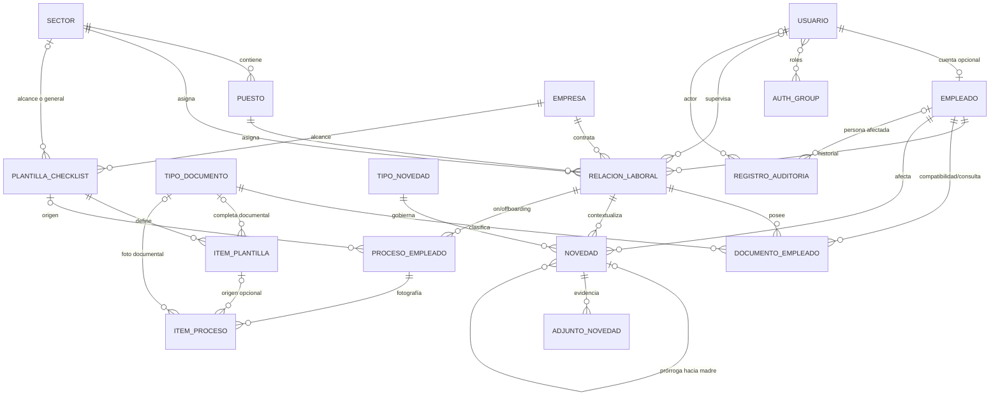

# MER — Modelo Entidad-Relación vigente

**Sistema:** Gestión RRHH · Grupo Vial Victoria

**Motor obligatorio:** PostgreSQL 16

**Actualizado:** 2026-07-24

**Fuente:** modelos y migraciones de `gestion_rrhh/apps/`

Este documento describe el modelo que debe salir a producción con el MVP1. Si contradice
una migración aplicada o una constraint de PostgreSQL, prevalece la base. Las decisiones
funcionales completas están en
[`../ARQUITECTURA_MVP1_PRODUCCION.md`](../ARQUITECTURA_MVP1_PRODUCCION.md).

## 1. Entidades

| Entidad | Tabla | Responsabilidad |
|---|---|---|
| `Usuario` | `usuarios_usuario` | Cuenta humana; roles mediante grupos Django |
| `Empresa` | `organizacion_empresa` | Empresa del grupo |
| `Sector` | `organizacion_sector` | Sector transversal |
| `Puesto` | `organizacion_puesto` | Puesto parametrizado dentro de un sector |
| `Parametro` | `organizacion_parametro` | Parametría clave→JSON |
| `Empleado` | `empleados_empleado` | Persona única en todo el grupo |
| `RelacionLaboral` | `empleados_relacionlaboral` | Etapa laboral de una persona en una empresa |
| `TipoDocumento` | `empleados_tipodocumento` | Catálogo documental y días de aviso |
| `DocumentoEmpleado` | `empleados_documentoempleado` | Documento de una relación laboral |
| `TipoNovedad` | `novedades_tiponovedad` | Catálogo y reglas de las novedades |
| `Novedad` | `novedades_novedad` | Evento de RRHH; una prórroga también es novedad |
| `AdjuntoNovedad` | `novedades_adjuntonovedad` | Evidencia de una novedad concreta |
| `PlantillaChecklist` | `onboarding_plantillachecklist` | Plantilla versionada por alcance |
| `ItemPlantilla` | `onboarding_itemplantilla` | Definición de un paso |
| `ProcesoEmpleado` | `onboarding_procesoempleado` | Checklist de una relación laboral |
| `ItemProceso` | `onboarding_itemproceso` | Foto y estado de un paso |
| `RegistroAuditoria` | `auditoria_registroauditoria` | Bitácora transversal append-only |

También existen las tablas estándar de sesiones, permisos, grupos y migraciones de
Django. La autenticación humana usa `django_session`; no se usan JWT ni
`token_blacklist`.

## 2. Diagrama principal



## 3. Núcleo organizacional y laboral

### Puesto

- `nombre`: único sin distinguir mayúsculas dentro de su sector.
- `sector`: obligatorio para toda alta o modificación nueva.
- `activo`: baja lógica.

El modelo conserva `null=True` únicamente para poder identificar filas históricas
huérfanas. La constraint `puesto_sector_requerido`, instalada con una estrategia de
migración segura, impide producir nuevos huérfanos.

### Empleado

- `legajo`: único y asignado por backend.
- `dni`: 6 a 9 dígitos normalizados, único.
- `cuil`: 11 dígitos normalizados, único cuando existe.
- `id_huella`: mayúsculas, sin espacios externos, único cuando existe.
- datos personales y contacto;
- `usuario`: uno-a-uno opcional con la cuenta humana.

DNI, CUIL e ID de huella se normalizan antes de guardar. La fecha de nacimiento no puede
estar en el futuro. El listado operativo no expone los identificadores sensibles.

### Relación laboral

| Campo | Regla |
|---|---|
| `empleado` | Persona de la etapa |
| `empresa` | Obligatoria e inmutable dentro de la etapa |
| `sector` | Obligatorio para una relación activa |
| `puesto` | Obligatorio, activo y perteneciente al sector |
| `supervisor` | Usuario activo con rol Supervisor o null |
| `fecha_ingreso` | Inicio inclusivo |
| `fecha_egreso` | Fin inclusivo; no anterior al ingreso |
| `estado` | `ACTIVA` o `FINALIZADA` |
| `motivo_egreso` | Obligatorio al finalizar |
| contrato/jornada | Datos de la asignación vigente |

Una persona tiene como máximo una relación activa en todo el grupo. Sus relaciones
históricas tampoco pueden solaparse. La empresa y el ingreso no se reescriben al editar la
asignación: una etapa nueva requiere baja y reingreso.

## 4. Documentos y reingreso

`DocumentoEmpleado` conserva `empleado` para consultas directas, pero su dueño funcional
es `relacion_laboral`. La combinación única es:

```text
(relacion_laboral, tipo_documento)
```

Por lo tanto, un reingreso abre un conjunto documental nuevo. Los documentos de una
relación finalizada quedan congelados; no completan el onboarding posterior. El archivo
es privado y su ruta nunca se publica como media estático.

## 5. Novedades

Toda novedad pertenece simultáneamente a un empleado, una relación laboral y un tipo.
Sus fechas deben quedar dentro de la vigencia de la relación.

Campos de workflow:

- `estado`: `REGISTRADA`, `EN_PROCESO`, `APROBADA`, `RECHAZADA`, `CERRADA` o `ANULADA`;
- actor y momento independientes para toma, aprobación, rechazo, cierre y anulación;
- `motivo_rechazo` y `motivo_anulacion`, obligatorios para esos estados;
- fechas de aviso, praxis, fin estimado, reintegro y certificado, cronológicamente
  validadas.

`ocupa_periodo` es una copia inmutable del flag del tipo, necesaria para que PostgreSQL
pueda aplicar la exclusión de rangos sin hacer un JOIN. Los tipos ya usados no permiten
cambiar flags semánticos.

Las prórrogas:

- apuntan siempre a la novedad madre;
- conservan tipo, empleado y relación;
- empiezan al día siguiente de la vigencia efectiva;
- se aprueban de a una;
- solo extienden reportes cuando están aprobadas o cerradas.

`AdjuntoNovedad` conserva cada evidencia; no reemplaza adjuntos anteriores y no tiene
vencimiento.

## 6. Onboarding y offboarding

El alcance de una plantilla es:

```text
(empresa, sector nullable, tipo_proceso)
```

`sector=null` representa la plantilla general de respaldo de una empresa. Cada alcance
puede tener una versión `BORRADOR` y una `PUBLICADA`; publicar archiva la anterior. Una
publicada no se edita.

El proceso se inicia mediante `POST` explícito e idempotente y queda anclado a una
relación. Sus ítems fotografían etiqueta, orden, tipo y documento de la versión usada.
Los pasos `ACCION` se tildan con actor/momento; los `DOCUMENTAL` se calculan desde el
documento de esa misma relación.

## 7. Auditoría

`RegistroAuditoria` no hereda de `ModeloBase` porque nunca se actualiza:

- `momento`, `usuario` y `usuario_nombre` congelado;
- `accion` semántica;
- entidad/objeto y representación congelada;
- agregado funcional para reconstruir cadenas;
- empleado afectado;
- valores antes/después;
- IP validada.

Las FKs de actor y empleado usan `PROTECT`. Los triggers
`auditoria_append_only` y `auditoria_append_only_truncate` bloquean `UPDATE`, `DELETE` y
`TRUNCATE`. El rol runtime de producción tampoco tiene privilegios para sortearlos.

## 8. Constraints e índices críticos

| Tabla | Constraint / índice | Garantía |
|---|---|---|
| `organizacion_puesto` | `puesto_nombre_sector_unico_ci` | Nombre único por sector, case-insensitive |
| `organizacion_puesto` | `puesto_sector_requerido` | No hay puestos nuevos sin sector |
| `empleados_empleado` | checks `empleado_*_normalizado` | DNI/CUIL/huella canónicos |
| `empleados_relacionlaboral` | `uniq_relacion_activa_por_empleado` | Una activa global |
| `empleados_relacionlaboral` | `excl_relaciones_solapadas_por_empleado` | Vigencias inclusivas sin solapamiento |
| `empleados_relacionlaboral` | `relacion_fechas_validas` | Egreso ≥ ingreso |
| `empleados_relacionlaboral` | `relacion_activa_con_catalogos` | Activa con sector y puesto |
| `empleados_relacionlaboral` | `relacion_estado_baja_coherente` | Estado, fecha y motivo coherentes |
| `empleados_documentoempleado` | `uniq_documento_por_relacion_tipo` | Un tipo por relación |
| `empleados_documentoempleado` | `documento_relacion_requerida` | Documento siempre atribuible |
| `novedades_novedad` | `excl_novedades_solapadas_por_empleado` | Novedades ocupantes sin solapamiento |
| `novedades_novedad` | checks de fechas/horas/motivos | Rango, horas y decisiones válidas |
| `onboarding_plantillachecklist` | `uniq_version_plantilla_por_alcance` | Versión única |
| `onboarding_plantillachecklist` | `uniq_plantilla_publicada_por_alcance` | Una publicada |
| `onboarding_plantillachecklist` | `uniq_plantilla_borrador_por_alcance` | Un borrador |
| `onboarding_procesoempleado` | `uniq_proceso_por_relacion_tipo` | Un proceso por relación/tipo |

Las exclusiones de rangos requieren la extensión PostgreSQL `btree_gist`. SQLite no es un
entorno de prueba válido para este sistema.

## 9. Reglas que requieren service además de la base

PostgreSQL cierra carreras estructurales, pero las reglas entre tablas se validan dentro
de transacciones con locks:

- puesto activo y perteneciente al sector;
- supervisor activo, humano y con rol Supervisor;
- empleado de documento/novedad igual al de la relación;
- fechas de novedad dentro de la relación;
- sector de plantilla compatible con el snapshot de la relación;
- bloqueo del cambio de sector después de iniciar un checklist;
- transiciones de workflow y cronología de sus actores;
- deactivación de catálogos o usuarios que todavía están en uso.

Nunca se deben reemplazar estos services por `ModelViewSet` genéricos que guarden
directamente.
