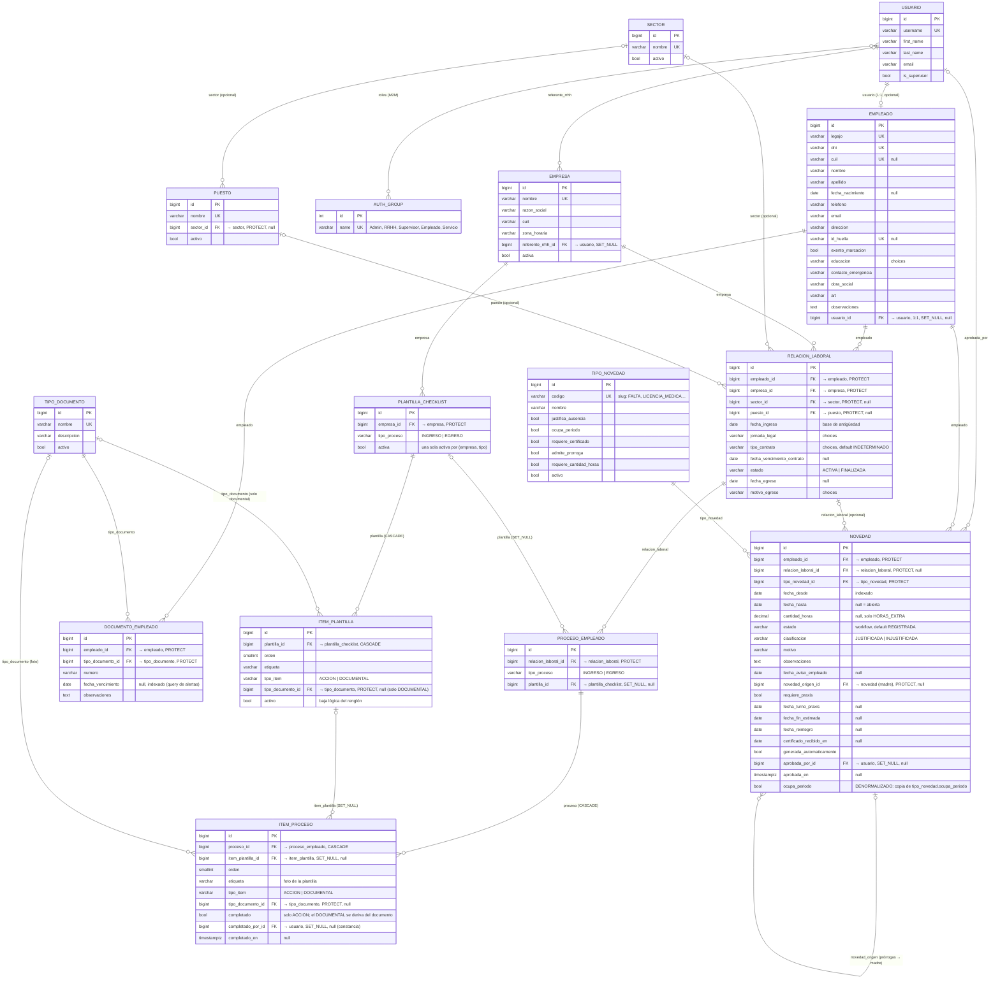
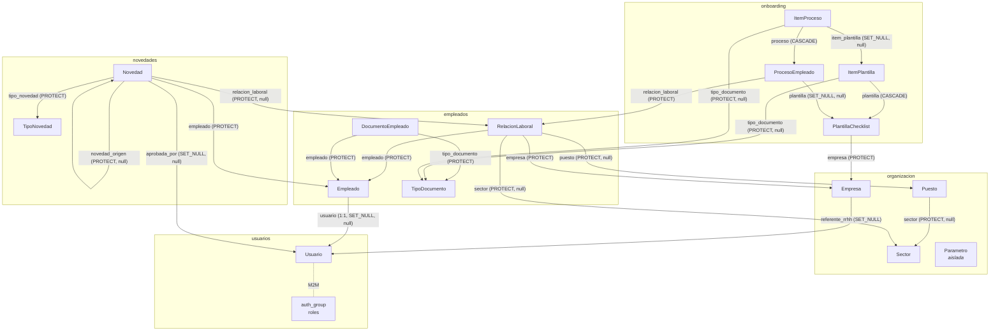

# MER — Modelo Entidad-Relación de la base de datos

**Sistema:** Gestión RRHH · Grupo Vial Victoria
**Fuente:** modelos Django en `gestion_rrhh/apps/` (estado al 2026-07-15, rama `fase-0-verificada`;
actualizado 2026-07-23 con la app `onboarding` — checklists de ingreso/egreso, CU-29/30)
**Motor:** PostgreSQL 16 (vía `docker compose up`) — **excluyente**: el modelo usa un índice
único parcial y una constraint de exclusión, que sqlite no soporta. Las migraciones no
corren fuera de Postgres.

Este documento describe las entidades del dominio, sus atributos y las relaciones
entre las tablas. Los diagramas están en Mermaid: GitHub y los artifacts de Claude
los renderizan nativamente.

---

## 1. Vista general de entidades

| Entidad (modelo) | Tabla en Postgres | Rol en el dominio |
|---|---|---|
| `Usuario` | `usuarios_usuario` | Usuario del sistema (extiende `AbstractUser`). Roles por Grupos de Django |
| `Empresa` | `organizacion_empresa` | Empresa del grupo (Vial Victoria, etc.) |
| `Sector` | `organizacion_sector` | Catálogo transversal al grupo (D11): RRHH, Obra, Logística… |
| `Puesto` | `organizacion_puesto` | Catálogo de puestos, opcionalmente asociado a un sector |
| `Parametro` | `organizacion_parametro` | Parametría del sistema (clave → JSON). Aislada, sin FKs de dominio |
| `Empleado` | `empleados_empleado` | La **persona**, única a nivel grupo (P1) |
| `RelacionLaboral` | `empleados_relacionlaboral` | Vínculo persona ↔ empresa con historial (ingreso/egreso) |
| `TipoDocumento` | `empleados_tipodocumento` | Catálogo de documentos con vencimiento (apto médico, CNRT…) |
| `DocumentoEmpleado` | `empleados_documentoempleado` | Documento vigente de un empleado, con vencimiento |
| `TipoNovedad` | `novedades_tiponovedad` | Catálogo de tipos con flags de comportamiento |
| `Novedad` | `novedades_novedad` | Evento de RRHH (falta, licencia, etc.). Las prórrogas son también `Novedad` |
| `PlantillaChecklist` | `onboarding_plantillachecklist` | Checklist configurable por empresa y tipo de proceso (ingreso/egreso) |
| `ItemPlantilla` | `onboarding_itemplantilla` | Renglón de la plantilla: acción (se tilda) o documental (ligado a un `TipoDocumento`) |
| `ProcesoEmpleado` | `onboarding_procesoempleado` | Instancia del checklist para una relación laboral; foto de la plantilla al crearse |
| `ItemProceso` | `onboarding_itemproceso` | Estado de cada ítem del proceso: tildado (acción) o derivado del documento (documental) |

Además participan tablas de infraestructura de Django: `auth_group` (roles: Admin,
RRHH, Supervisor, Empleado, Servicio), `usuarios_usuario_groups` (M2M usuario↔rol) y
las tablas de `token_blacklist` de SimpleJWT.

**Auditoría mínima (`ModeloBase`):** todos los modelos de dominio heredan
`creado_en`, `actualizado_en` y `creado_por` (FK → `Usuario`, `SET_NULL`). Esas FKs
de auditoría no se dibujan en el diagrama principal para no ensuciarlo.

---

## 2. Diagrama Entidad-Relación (MER)

> `PARAMETRO (id PK, clave UK, valor JSONB, descripcion)` no se dibuja: no tiene
> relaciones con el resto del dominio.

---

## 3. Diagrama de relaciones entre tablas (vista de dependencias)

Flechas en el sentido de la FK (quién apunta a quién). Útil para entender el orden
de carga y qué protege a qué (`PROTECT` = no se puede borrar el destino si tiene
filas que lo referencian).

---

## 4. Relaciones y cardinalidades (detalle)

| # | Relación | Cardinalidad | FK / on_delete | Regla de negocio |
|---|---|---|---|---|
| 1 | Usuario — Empleado | 1 : 0..1 | `Empleado.usuario`, SET_NULL | Solo si el empleado accede al sistema |
| 2 | Usuario — Grupo (rol) | N : M | M2M de Django | Roles §7: Admin, RRHH, Supervisor, Empleado, Servicio |
| 3 | Usuario — Empresa | 1 : N (opcional) | `Empresa.referente_rrhh`, SET_NULL | Destinatario de avisos de la empresa (D9) — aún sin uso |
| 4 | Sector — Puesto | 1 : N (opcional) | `Puesto.sector`, PROTECT | Un puesto puede o no colgar de un sector |
| 5 | Empleado — RelacionLaboral | 1 : N | `RelacionLaboral.empleado`, PROTECT | Historial completo; **R1**: máx. una ACTIVA por (empleado, empresa) |
| 6 | Empresa — RelacionLaboral | 1 : N | `RelacionLaboral.empresa`, PROTECT | La pertenencia a una empresa se da SOLO por acá (P1) |
| 7 | Sector — RelacionLaboral | 1 : N (opcional) | PROTECT | Sector transversal al grupo (D11) |
| 8 | Puesto — RelacionLaboral | 1 : N (opcional) | PROTECT | — |
| 9 | Empleado — DocumentoEmpleado | 1 : N | PROTECT | Máx. **uno vigente por tipo** (UNIQUE empleado+tipo) |
| 10 | TipoDocumento — DocumentoEmpleado | 1 : N | PROTECT | Catálogo (cierra gap #1: APTO_MEDICO, CNRT…) |
| 11 | Empleado — Novedad | 1 : N | PROTECT | Regla `ocupa_periodo`: dos novedades que ocupan período no conviven en las mismas fechas. Garantizada en la base por `excl_novedades_solapadas_por_empleado` (§5), no solo en el service |
| 12 | RelacionLaboral — Novedad | 1 : N (opcional) | PROTECT | Contexto empresa/contrato; default = relación activa al momento de la carga |
| 13 | TipoNovedad — Novedad | 1 : N | PROTECT | Los flags del tipo gobiernan las validaciones |
| 14 | Novedad — Novedad (autorreferencia) | 1 : N | `novedad_origen`, PROTECT | **Cadena de prórrogas (§6 bis)**: cada prórroga apunta SIEMPRE a la madre (no a la prórroga anterior). Vigencia efectiva = calculada, nunca guardada |
| 15 | Usuario — Novedad | 1 : N (opcional) | `aprobada_por`, SET_NULL | Solo RRHH/Admin aprueban (R11) |
| 16 | Empresa — PlantillaChecklist | 1 : N | `PlantillaChecklist.empresa`, PROTECT | El checklist puede diferir por empresa; **una sola activa** por (empresa, tipo) |
| 17 | PlantillaChecklist — ItemPlantilla | 1 : N | `ItemPlantilla.plantilla`, CASCADE | Los renglones se borran con la plantilla |
| 18 | TipoDocumento — ItemPlantilla | 1 : N (opcional) | `ItemPlantilla.tipo_documento`, PROTECT | Solo ítems DOCUMENTAL; enlaza al doc del legajo que lo completa |
| 19 | RelacionLaboral — ProcesoEmpleado | 1 : N | `ProcesoEmpleado.relacion_laboral`, PROTECT | El proceso cuelga de la relación (no del empleado): el reingreso no pisa el anterior. **Único** por (relación, tipo) |
| 20 | PlantillaChecklist — ProcesoEmpleado | 1 : N (opcional) | `ProcesoEmpleado.plantilla`, SET_NULL | Referencia a la plantilla fotografiada; puede quedar null |
| 21 | ProcesoEmpleado — ItemProceso | 1 : N | `ItemProceso.proceso`, CASCADE | Los ítems (foto) se borran con el proceso |
| 22 | ItemPlantilla — ItemProceso | 1 : N (opcional) | `ItemProceso.item_plantilla`, SET_NULL | Renglón de origen; se conserva la foto aunque la plantilla cambie |
| 23 | TipoDocumento — ItemProceso | 1 : N (opcional) | `ItemProceso.tipo_documento`, PROTECT | Foto del tipo de doc; el "hecho" del ítem documental se **deriva** de `DocumentoEmpleado` (no se persiste) |
| 24 | Usuario — ItemProceso | 1 : N (opcional) | `completado_por`, SET_NULL | Constancia de quién tildó el ítem de acción |
| 25 | Usuario — (todas las de dominio) | 1 : N | `creado_por`, SET_NULL | Auditoría mínima de `ModeloBase` |

---

## 5. Constraints e índices relevantes

| Tabla | Constraint / índice | Definición | Para qué |
|---|---|---|---|
| `empleados_relacionlaboral` | `uniq_relacion_activa_por_empresa` | UNIQUE parcial `(empleado, empresa) WHERE estado='ACTIVA'` | R1: una sola relación activa por empresa. **Requiere Postgres** (índice parcial) |
| `empleados_documentoempleado` | `uniq_documento_vigente_por_tipo` | UNIQUE `(empleado, tipo_documento)` | Un documento vigente por tipo |
| `empleados_empleado` | UNIQUE | `legajo`, `dni`, `cuil` (null), `id_huella` (null) | Persona única a nivel grupo; matching biométrico futuro (P2). El `legajo` lo asigna el backend (`max(numérico)+1` con advisory lock), no el cliente |
| `empleados_documentoempleado` | índice | `fecha_vencimiento` | Query de alertas de vencimiento |
| `novedades_novedad` | `excl_novedades_solapadas_por_empleado` | `EXCLUDE USING GIST (empleado_id WITH =, daterange(fecha_desde, fecha_hasta, '[]') WITH &&) WHERE (estado IN ('REGISTRADA','EN_PROCESO','APROBADA','CERRADA') AND ocupa_periodo)` | Dos novedades que ocupan período no conviven. **Requiere Postgres + extensión `btree_gist`** |
| `novedades_novedad` | índices | `empleado`, `fecha_desde`, `novedad_origen` | Listados, solapamiento y armado de cadenas |
| `novedades_tiponovedad` | UNIQUE | `codigo` (slug) | Contrato estable con el front (FALTA, LICENCIA_MEDICA…) |
| `organizacion_*` | UNIQUE | `nombre` (empresa/sector/puesto), `clave` (parámetro) | Catálogos sin duplicados |
| `onboarding_plantillachecklist` | `uniq_plantilla_activa_por_empresa_tipo` | UNIQUE parcial `(empresa, tipo_proceso) WHERE activa` | Una sola plantilla activa por empresa y tipo. **Requiere Postgres** (índice parcial) |
| `onboarding_itemplantilla` | `item_documental_exige_tipo_documento` | CHECK: `DOCUMENTAL` ⇒ `tipo_documento` NOT NULL; `ACCION` ⇒ NULL | Coherencia tipo↔documento en la base (además del service) |
| `onboarding_procesoempleado` | `uniq_proceso_por_relacion_tipo` | UNIQUE `(relacion_laboral, tipo_proceso)` | Un solo proceso por (relación, tipo): ancla del `get_or_create` perezoso |

**Extensiones de Postgres requeridas:** `btree_gist` (la crea la migración
`novedades/0003`). Sin ella no se puede mezclar igualdad (`empleado_id WITH =`) con
solapamiento de rangos (`WITH &&`) en un mismo índice GiST.

**Sobre `Novedad.ocupa_periodo` (columna denormalizada):** una `ExclusionConstraint` solo
ve columnas de su propia tabla — no puede hacer JOIN a `TipoNovedad` para leer el flag de
ahí. Por eso el flag se copia a `Novedad` en `save()` y el constraint filtra por esa copia.
Consecuencia a tener presente: si se cambia `ocupa_periodo` en un `TipoNovedad` ya usado,
las novedades ya cargadas conservan el valor con el que nacieron y hay que backfillear a
mano. El service (`_validar_sin_solapamiento`) filtra por la misma columna a propósito,
para que la validación amigable y el constraint nunca discrepen.

---

## 6. Convenciones del modelo

- **Baja lógica, nunca DELETE físico** (R10): las relaciones laborales se
  *finalizan* (`estado=FINALIZADA` + fecha y motivo de egreso); los catálogos se
  desactivan (`activo=False`).
  **Única excepción:** `DELETE /empleados/{id}/documentos/{doc_id}/` borra físicamente.
  Un documento cargado por error no es un hecho del dominio que valga la pena preservar, y
  el UNIQUE `(empleado, tipo_documento)` impide recargarlo si el anterior sigue ahí.
- **PROTECT por defecto** en FKs de dominio: no se puede borrar una empresa,
  sector, puesto, tipo o empleado que tenga historia colgando.
- **Datos derivados jamás se persisten**: la antigüedad (`antiguedad_en_dias`), la
  vigencia efectiva de una cadena de prórrogas y todas las métricas del dashboard
  se calculan on-the-fly.
  **Única excepción:** `Novedad.ocupa_periodo`, copia del flag de su `TipoNovedad`. No es
  una optimización sino un requisito estructural: una `ExclusionConstraint` no puede leer
  una columna de otra tabla, y sin esa copia la regla de no-solapamiento no puede vivir en
  la base. Ver la nota de la sección 5.
- **Todo en UTC en la base** (`USE_TZ=True`); zona operativa
  `America/Argentina/Buenos_Aires` (P5).
- **Workflow de Novedad** (§21): `REGISTRADA → EN_PROCESO → APROBADA / RECHAZADA →
  CERRADA`, más `ANULADA`. Las transiciones son acciones explícitas de la API
  (`/aprobar/`, `/rechazar/`, `/anular/`, `/prorrogar/`), nunca un PATCH del campo.
